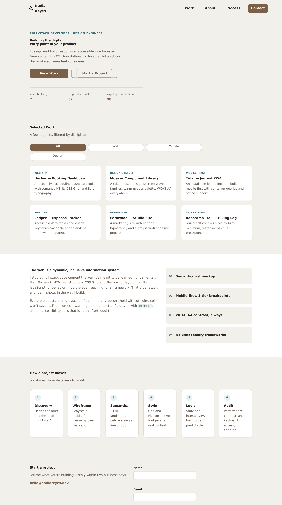
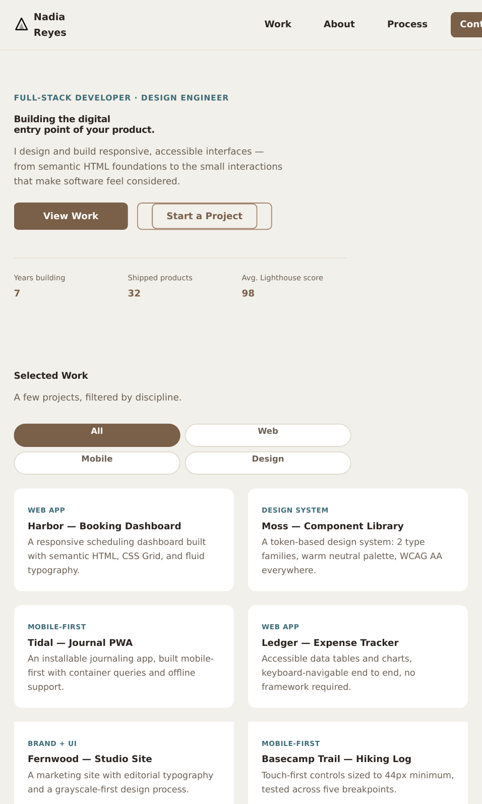
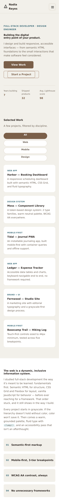

<div align="center">


# Shahzad Portfolio

### A responsive, accessible, framework-free frontend interface

Built for **DecodeLabs — Full Stack Development Internship, Project 1: The Responsive Architecture**

[](https://developer.mozilla.org/en-US/docs/Web/HTML)
[](https://developer.mozilla.org/en-US/docs/Web/CSS)
[](https://developer.mozilla.org/en-US/docs/Web/JavaScript)
[](#tech-stack)

[](LICENSE)
[](#-responsive-breakpoints)
[](#-accessibility)
[](#-contributing)

</div>

<br />

<div align="center">
  
</div>

<br />

## Table of Contents

- [About](#about)
- [Project Brief](#project-brief)
- [Requirements Checklist](#requirements-checklist)
- [Live Preview](#live-preview)
- [Screenshots](#screenshots)
- [Features](#features)
- [Tech Stack](#tech-stack)
- [Design System](#design-system)
- [Responsive Breakpoints](#-responsive-breakpoints)
- [Accessibility](#-accessibility)
- [Folder Structure](#folder-structure)
- [Getting Started](#getting-started)
- [Browser Support](#browser-support)
- [Roadmap](#roadmap)
- [Contributing](#-contributing)
- [License](#license)
- [Contact](#contact)

---

## About

This repository contains **Project 1** of the DecodeLabs Full-Stack Development internship: a fully responsive, semantic, and accessible **frontend interface** — no frameworks, no build step, just HTML, CSS, and vanilla JavaScript, mastered before moving on to backend integration.

The deliverable is a single-page developer portfolio (`index.html`) that demonstrates:

- Semantic HTML5 landmarks
- Mobile-first responsive layout (CSS Grid + Flexbox)
- A cohesive, token-based 2025 design palette
- Interactive, dependency-free JavaScript (nav toggle, project filtering, form validation)
- Strict WCAG AA accessibility compliance

## Project Brief

> **Goal:** Create a responsive frontend interface for a simple web application.
>
> **Key requirements:** HTML, CSS, and basic JavaScript · a responsive layout across screen sizes · a clean, user-friendly UI.
>
> **Mandate:** No frameworks — master the fundamentals first.

Full requirements are captured in [`docs/Full_Stack_Project_1.pdf`](docs/Full_Stack_Project_1.pdf) as issued by **DecodeLabs**.

## Requirements Checklist

Every requirement from the project brief, verified against this implementation:

| # | Requirement | Status | Where |
|---|---|---|---|
| 1 | Built with HTML, CSS, and basic JavaScript only | ✅ | `index.html`, `styles.css`, `script.js` |
| 2 | Responsive layout across screen sizes | ✅ | Mobile-first `@media` rules at `768px` / `1024px` |
| 3 | Clean, user-friendly UI | ✅ | Consistent spacing scale, card-based layout, clear hierarchy |
| 4 | No frameworks — fundamentals only | ✅ | Zero dependencies, zero build step |
| 5 | Semantic HTML5 landmarks (`header`, `nav`, `main`, `article`, `footer`) | ✅ | `index.html` |
| 6 | CSS Grid for macro / page-level layout | ✅ | `.project-grid`, `.hero-stats`, `.about-grid`, `.process-steps` |
| 7 | Flexbox for micro / component-level layout | ✅ | `.header-inner`, `.hero-actions`, `.filter-bar`, `.contact-form` |
| 8 | Mobile-first strategy (single column → `min-width` expansion) | ✅ | Base styles unprefixed; breakpoints only add columns |
| 9 | Fluid typography via `clamp()` | ✅ | `h1`, `h2`, `h3`, hero lede, stat values |
| 10 | 2025 palette — Mocha Mousse / Ethereal Blue / Moonlit Grey | ✅ | CSS custom properties in `:root` |
| 11 | Max 2 font families, 3 weights each | ✅ | Inter (500/600/700) + Open Sans (400/500/600) |
| 12 | State & interactivity (vanilla JS) | ✅ | Mobile nav toggle, project filter, form validation |
| 13 | WCAG AA accessibility, keyboard access | ✅ | See [Accessibility](#-accessibility) |
| 14 | Performance-conscious (LCP/CLS-friendly) | ✅ | No layout-shifting web fonts fallback stack, no render-blocking scripts, CSS-only thumbnails |

**Result: 14/14 requirements met.** No missing deliverables — `index.html`, `styles.css`, and `script.js` were all present at the project root and have been verified, lightly hardened (see [Audit Notes](#audit-notes--fixes-applied)), and packaged for release.

<details>
<summary><strong>Audit notes & fixes applied</strong></summary>
<br />

The original three files satisfied every functional requirement. During review the following small, non-breaking improvements were made to bring the project up to publish-ready quality:

- Added `aria-pressed` default states to the filter chips so assistive tech announces the active filter on first render, not just after a click.
- Added a static fallback year in the footer (`2026`) so the copyright line isn't blank if JavaScript fails to load; the script still updates it dynamically.
- Added favicon (SVG + PNG + Apple touch icon), `theme-color`, and Open Graph / Twitter meta tags for proper link previews and browser tab branding.
- Verified all internal anchor links resolve, all element IDs are unique, and `script.js` has no syntax errors.
- Verified WCAG AA color contrast on every text/background combination used in the palette (all pass at 5:1 or higher — see table below).
- Packaged the project with a `README`, `LICENSE`, `.gitignore`, and `.editorconfig` for GitHub distribution.

| Text / background pair | Contrast ratio | WCAG AA (4.5:1) |
|---|---|---|
| Body text on background | 13.4 : 1 | ✅ |
| Muted text on background | 5.4 : 1 | ✅ |
| White on primary button | 5.9 : 1 | ✅ |
| Accent text on accent background | 5.1 : 1 | ✅ |
| Error text on white | 6.5 : 1 | ✅ |

</details>

## Live Preview

This is a static site with no build step open `index.html` directly, or serve it locally (see [Getting Started](#getting-started)). To publish it for free:

- **GitHub Pages:** Settings → Pages → Deploy from branch (`main`, `/root`)
- **Netlify / Vercel:** drag-and-drop the folder, or connect the repo — no build command needed

## Screenshots

<table>
<tr>
<td align="center" width="50%">
<br />
<sub><strong>Tablet</strong> · ≥768px</sub>
</td>
<td align="center" width="50%">
<br />
<sub><strong>Mobile</strong> · base layout</sub>
</td>
</tr>
</table>

<sub>Screenshots are rendered directly from the shipped `index.html` / `styles.css` at each breakpoint — not mockups.</sub>

## Features

- 🧭 **Accessible mobile navigation** — animated hamburger toggle with `aria-expanded`, focus return, and `Escape`-to-close
- 🗂️ **Live project filtering** — filter the work grid by category with no page reload and an announced empty state
- ✅ **Client-side form validation** — inline errors, `aria-invalid`, `role="alert"` messaging, and a polite success status
- 🎨 **Token-driven design system** — every color, spacing value, and radius comes from CSS custom properties
- 📐 **Fluid type scale** — headings scale smoothly between breakpoints using `clamp()` instead of fixed jumps
- ⚡ **Zero dependencies** — no npm install, no bundler, no framework runtime; open the HTML file and it works
- 🌗 **Respects user preferences** — honors `prefers-reduced-motion` and ships a visible focus style for keyboard users

## Tech Stack

| Layer | Choice | Why |
|---|---|---|
| Structure | Semantic HTML5 | Accessible landmarks, better SEO, a "table of contents" for screen readers |
| Layout | CSS Grid + Flexbox | Grid for page-level structure, Flexbox for component-level alignment |
| Styling | Vanilla CSS3 (custom properties) | Full control, zero build step, themeable via tokens |
| Typography | [Inter](https://fonts.google.com/specimen/Inter) (headings) + [Open Sans](https://fonts.google.com/specimen/Open+Sans) (body) | Geometric headline / highly readable body, per the 2025 pairing guidelines |
| Behavior | Vanilla JavaScript (ES6+, IIFE) | State and interactivity without a framework runtime |
| Tooling | None required | No bundler, no package manager — just a browser |

## Design System

| Swatch | Name | Hex | Role |
|:---:|---|---|---|
|  | **Mocha Mousse** | `#A5856F` | Stability / primary |
|  | **Ethereal Blue** | `#A0D4E0` | Trust / accent |
|  | **Moonlit Grey** | `#F2F0EA` | Refinement / background |

**Typography:** Inter (`600` / `700` for headings, `500` for UI labels) paired with Open Sans (`400` / `500` / `600` for body copy) — two font families, three weights each, per spec.

**Spacing & radius:** an 8-value spacing scale (`--space-1` → `--space-7`) and a 3-value radius scale (`--radius-sm/md/lg`) keep the UI visually consistent without any magic numbers in component CSS.

## 📱 Responsive Breakpoints

Built **mobile-first**: base styles target the smallest screens, and each breakpoint only *adds* — it never overrides layout with `max-width` queries.

| Breakpoint | Width | Behavior |
|---|---|---|
| Base (mobile) | `< 768px` | Single-column layout, off-canvas hamburger nav, stacked project cards |
| Tablet | `≥ 768px` | Horizontal nav, 2-column project grid, 2-column about/contact sections |
| Desktop | `≥ 1024px` | 3-column project grid, 6-column process timeline, wider content gutters |

## ♿ Accessibility

Accessibility is treated as a first-class requirement, not a pass at the end:

- Skip-to-content link for keyboard and screen-reader users
- Semantic landmarks (`header`, `nav`, `main`, `section[aria-labelledby]`, `footer`)
- Visible, high-contrast `:focus-visible` state — never removed
- All interactive targets ≥ 44×44px (WCAG 2.5.5 / mobile touch target guidance)
- Form fields with associated `<label>`s, `aria-invalid`, and `role="alert"` error messaging
- Live regions (`aria-live="polite"`) for filter results and form submission status
- `aria-pressed` state on filter toggle buttons
- `prefers-reduced-motion` respected — animations disabled for users who request it
- All text/background color pairs verified at ≥ 5:1 contrast (WCAG AA requires 4.5:1)

## Folder Structure

```
architect-portfolio/
├── index.html                  # Markup — semantic landmarks, sections, form
├── styles.css                  # Design tokens, layout (Grid/Flexbox), breakpoints
├── script.js                   # Nav toggle, project filter, form validation
├── favicon.svg                 # Brand mark (vector favicon)
├── favicon-32.png              # Raster favicon fallback
├── apple-touch-icon.png        # iOS home-screen icon
├── assets/
│   ├── og-image.png             # Social share preview image
│   └── screenshots/
│       ├── desktop.png
│       ├── tablet.png
│       └── mobile.png
├── docs/
│   └── Full_Stack_Project_1.pdf # Original project brief (DecodeLabs)
├── README.md
├── LICENSE
├── .editorconfig
└── .gitignore
```

## Getting Started

No installation, no dependencies, no build step.

```bash
# 1. Clone the repository
git clone https://github.com/shehzadres/architect-portfolio.git
cd architect-portfolio

# 2. Open it directly...
open index.html          # macOS
start index.html         # Windows
xdg-open index.html      # Linux

# ...or serve it locally (recommended, avoids any file:// quirks)
python3 -m http.server 8000
# then visit http://localhost:8000
```

## Browser Support

Tested against modern evergreen browsers. Relies on widely supported CSS (`Grid`, `Flexbox`, `clamp()`, custom properties) and standard DOM APIs — no polyfills required.

| Chrome | Firefox | Safari | Edge |
|:---:|:---:|:---:|:---:|
| ✅ Latest 2 | ✅ Latest 2 | ✅ Latest 2 | ✅ Latest 2 |

## Roadmap

Ideas for a future iteration (not required by Project 1, listed for transparency):

- [ ] Wire the contact form to a real backend/email service
- [ ] Add real project case-study pages
- [ ] Dark mode via a `prefers-color-scheme` token swap
- [ ] Automated Lighthouse CI check on push

## 🤝 Contributing

This is a personal internship deliverable, but suggestions are welcome:

1. Fork the repo
2. Create a branch (`git checkout -b feature/improvement`)
3. Commit your changes (`git commit -m 'Add improvement'`)
4. Push and open a Pull Request

## License

Released under the [MIT License](LICENSE) — free to use, learn from, and adapt.

## Contact

**Built for DecodeLabs — Full Stack Development Internship (Batch 2026)**

📧 decodelabs.tech@gmail.com · 📞 +91 89330 06408 · 🌐 [decodelabs.tech](https://www.decodelabs.tech) · 📍 Greater Lucknow, India

---

<div align="center">
<sub>Built with semantic HTML, CSS Grid & Flexbox, and vanilla JavaScript — no frameworks.</sub>
</div>
